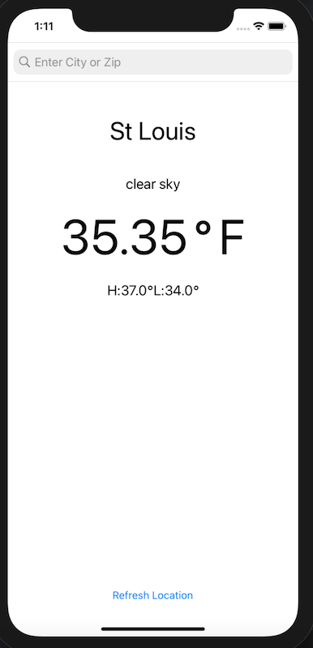

#  Weather App

## Recent Updates
### As of Feb 26, 2021
- Reformatted code to make less redundant.  WeatherViewController now has updateUI() and Networking has parseJSONtoWeather().
- Can build url with search queries containing spaces now.
- WeatherModel now has computed string properties of formatted temp values.
- The view now displays formatted temp values.
- Slight spacing changes on labels in the view.

## About
Weather app developed for take home assignment.  

## Features
search current weather using [Open Weather's API](https://openweathermap.org/api).  Find weather by city name, zip code, or GPS coordinates.

### To Run
- Open app on Xcode on run simulator.
- Allow app access to user location in order to search weather via longitude / latitude.
- Enter city name or zip code to search a cities current weather.
- Push refresh location to grab weather at current location again.

## Screenshots

